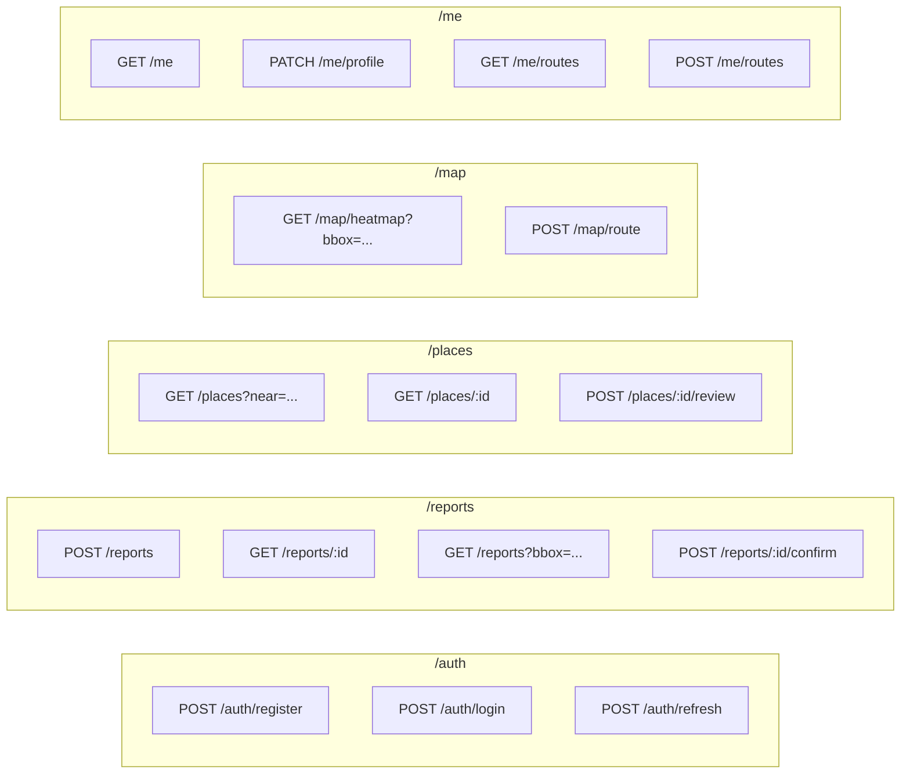

# API Spec — Rutas Libres

FastAPI · REST · JSON · JWT auth.

Base URL local: `http://localhost:8000/api/v1`

## Convenciones

- Auth: `Authorization: Bearer <jwt>` salvo endpoints públicos marcados.
- Errores: formato [RFC 7807 Problem Details](https://datatracker.ietf.org/doc/html/rfc7807).
- Timestamps: ISO 8601 UTC.
- IDs: UUID v4.
- Paginación: `?limit=50&cursor=<opaque>`.

## Mapa de endpoints



## Endpoints en detalle

### POST /reports
Crear reporte de barrera o mejora. **Multipart** (foto + JSON).

**Request (multipart/form-data):**
```
photo: <binary>
payload: {
  "location": {"lat": -34.6037, "lng": -58.3816},
  "barrier_type": "broken_ramp",
  "severity": "high",
  "description": "Rampa rota en esquina",
  "place_id": null
}
```

**Response 202:**
```json
{
  "report_id": "7c9e6679-7425-40de-944b-e07fc1f90ae7",
  "status": "queued",
  "estimated_processing_ms": 5000
}
```

**Errors:** `400` payload inválido · `413` foto > 10MB · `429` rate limit.

### GET /reports?bbox=sw_lng,sw_lat,ne_lng,ne_lat
Reportes dentro de un bounding box. Para render del mapa.

**Query:**
- `bbox` (required): `-58.4,-34.7,-58.3,-34.6`
- `status`: default `approved`
- `since`: ISO timestamp, solo reportes posteriores

**Response 200:**
```json
{
  "items": [
    {
      "id": "...",
      "location": {"lat": -34.6037, "lng": -58.3816},
      "barrier_type": "broken_ramp",
      "severity": "high",
      "created_at": "2026-04-19T12:34:56Z",
      "photo_url": "https://..."
    }
  ],
  "next_cursor": null
}
```

### POST /reports/:id/confirm
Otro usuario confirma que la barrera sigue ahí (valida crowdsourcing).

### GET /map/heatmap?bbox=...&zoom=14
Agregación para heatmap. Devuelve celdas grid-snapped con conteo.

**Response 200:**
```json
{
  "zoom": 14,
  "cells": [
    {"lat": -34.603, "lng": -58.381, "count": 12, "severity_avg": 2.4}
  ]
}
```

### POST /map/route
Calcular ruta accesible entre dos puntos.

**Request:**
```json
{
  "from": {"lat": -34.603, "lng": -58.381},
  "to": {"lat": -34.610, "lng": -58.390},
  "profile": "wheelchair"
}
```

**Response 200:**
```json
{
  "path": [[lng,lat], [lng,lat], ...],
  "distance_m": 1240,
  "duration_s": 960,
  "avoided_barriers": 3,
  "warnings": [
    {"location": {...}, "type": "stairs", "severity": "blocking"}
  ]
}
```

### GET /places?near=lat,lng&radius=500&min_score=70
Lugares accesibles cerca de un punto.

### POST /places/:id/review
Review con tags de accesibilidad.

```json
{
  "rating": 4,
  "accessibility_tags": {
    "ramp": "good",
    "bathroom": "accessible",
    "door_width": "ok"
  },
  "comment": "Entrada sin desnivel, baño amplio."
}
```

## Códigos de error estándar

| Código | Significado | Ejemplo |
|---|---|---|
| 400 | Validación | bbox malformado |
| 401 | No autenticado | JWT ausente o expirado |
| 403 | Prohibido | moderar sin rol admin |
| 404 | No existe | report_id inválido |
| 409 | Conflicto | review duplicada |
| 413 | Payload grande | foto > 10MB |
| 422 | Inválido semántico | lat fuera de rango |
| 429 | Rate limit | > 20 reports/hora/user |
| 500 | Bug server | loguear trace_id |
| 502 | Vertex/Google caído | retry con backoff |

## Rate limits iniciales

- `POST /reports`: 20/hora/usuario
- `POST /places/:id/review`: 5/día/usuario/lugar
- `GET /reports`: 600/hora/usuario
- `POST /map/route`: 100/hora/usuario (caro por Google Directions)
