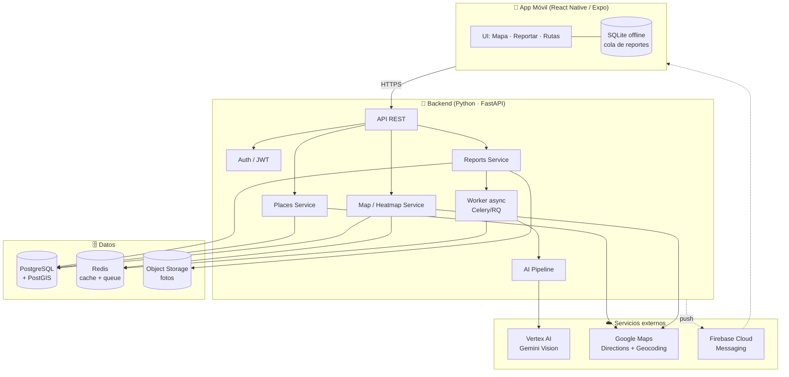
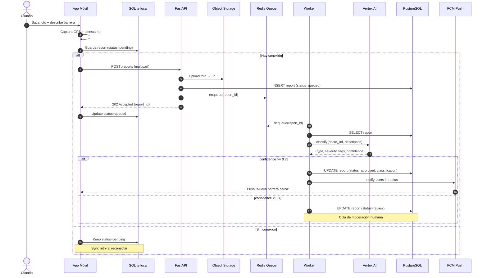

# Arquitectura — Rutas Libres

## 1. Overview del sistema

Diagrama de alto nivel: usuarios móviles, backend, servicios externos y datos.

### Decisiones clave

- **PostgreSQL + PostGIS**: consultas geoespaciales nativas (radio, intersección de rutas, clustering). Alternativa considerada: MongoDB con índices 2dsphere — descartada por menor potencia en joins espaciales.
- **FastAPI**: tipado fuerte, OpenAPI automático, async nativo para orquestar llamadas a Vertex AI y Google Maps en paralelo.
- **Worker async** para el pipeline de IA: la clasificación de una foto puede tardar 3-8s, no puede bloquear el request.
- **Cola offline en mobile**: el usuario reporta donde no hay señal (subte, zonas rurales). Los reportes se encolan en SQLite y se sincronizan al reconectar.

---

## 2. Flujo del reporte con IA

Desde que el usuario saca la foto hasta que la barrera aparece en el mapa de otros usuarios.

### Puntos críticos del flujo

- **Paso 3-4**: el reporte se persiste localmente *antes* de intentar subirlo. Si la app crashea o pierde señal, el dato no se pierde.
- **Paso 8**: el API responde `202 Accepted` inmediatamente. El cliente no espera a la IA.
- **Paso 14**: umbral de confianza en 0.7 — por debajo va a moderación humana. Ajustable según métricas de falsos positivos.
- **Paso 15**: notificación solo a usuarios con rutas guardadas que intersecten el radio del reporte (no broadcast global).

---

## 3. Próximos documentos

- [`data-model.md`](./data-model.md) — esquema de tablas, índices geoespaciales, relaciones.
- [`api-spec.md`](./api-spec.md) — endpoints, contratos, códigos de error.
