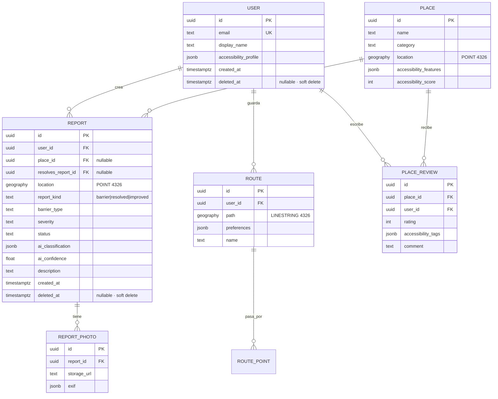

# Modelo de datos — Rutas Libres

> Decisión más cara de cambiar después. Definir ahora con cuidado.

## Stack

- **PostgreSQL 16** + extensión **PostGIS 3.x**
- Migraciones vía **Alembic**
- Tipos geoespaciales: `GEOGRAPHY(POINT, 4326)` para lugares, `GEOGRAPHY(LINESTRING, 4326)` para rutas

## Entidades principales



## Tablas en detalle

### `user`
Perfil mínimo. `accessibility_profile` guarda preferencias del usuario (silla de ruedas, baja visión, etc.) para personalizar rutas y alertas.

| columna | tipo | notas |
|---|---|---|
| id | uuid | PK, `gen_random_uuid()` |
| email | text | unique, indexado |
| display_name | text | opcional, público |
| accessibility_profile | jsonb | `{mobility: "wheelchair", vision: "low", ...}` |
| created_at | timestamptz | default `now()` |
| deleted_at | timestamptz | nullable · soft delete (ver Decisiones cerradas) |

### `place`
Lugar físico (comercio, estación, plaza). Puede venir de Google Places o ser creado por reportes agrupados.

| columna | tipo | notas |
|---|---|---|
| id | uuid | PK |
| name | text | |
| category | text | `restaurant`, `transit`, `public_space`, ... |
| location | geography(POINT, 4326) | **GIST index** |
| accessibility_features | jsonb | `{ramp: true, elevator: false, braille: true, ...}` |
| accessibility_score | int | 0-100, recalculado vía trigger |
| google_place_id | text | nullable, para sync |

### `report`
Núcleo del sistema. Un reporte de barrera, resolución o mejora puntual.

| columna | tipo | notas |
|---|---|---|
| id | uuid | PK |
| user_id | uuid | FK → user |
| place_id | uuid | FK → place, nullable (puede ser en vía pública) |
| resolves_report_id | uuid | FK → report, nullable. Apunta al reporte `barrier` original cuando `report_kind ∈ {resolved, improved}` |
| location | geography(POINT, 4326) | **GIST index** |
| report_kind | text | enum: `barrier` \| `resolved` \| `improved`. Default `barrier`. Nunca se edita el reporte original — se crea uno nuevo (ver Decisiones cerradas) |
| barrier_type | text | `stairs`, `broken_ramp`, `obstacle`, `no_signage`, ... |
| severity | text | `low`, `medium`, `high`, `blocking` |
| status | text | `pending`, `queued`, `approved`, `review`, `rejected` |
| ai_classification | jsonb | output crudo del modelo |
| ai_confidence | float | 0.0-1.0 |
| description | text | input del usuario |
| created_at | timestamptz | |
| expires_at | timestamptz | nullable, para barreras temporales (obra) |
| deleted_at | timestamptz | nullable · soft delete (ver Decisiones cerradas) |

**Reglas de negocio:**
- Cuando entra un `resolved` con `confidence >= 0.7` y apunta a un `barrier` activo → marcar el `barrier` como `status = 'resolved'` pero mantenerlo en tabla (no borrar). Así queda el historial.
- `resolves_report_id` debe ser `NULL` si `report_kind = 'barrier'`.
- `resolves_report_id` debe ser `NOT NULL` si `report_kind IN ('resolved', 'improved')`. Se valida por `CHECK` constraint.

**Índices clave:**
- `CREATE INDEX idx_report_location ON report USING GIST(location) WHERE deleted_at IS NULL;`
- `CREATE INDEX idx_report_status_created ON report(status, created_at DESC) WHERE deleted_at IS NULL;`
- `CREATE INDEX idx_report_place ON report(place_id) WHERE place_id IS NOT NULL AND deleted_at IS NULL;`
- `CREATE INDEX idx_report_resolves ON report(resolves_report_id) WHERE resolves_report_id IS NOT NULL;`

**Constraints:**
```sql
ALTER TABLE report ADD CONSTRAINT chk_resolves_matches_kind CHECK (
  (report_kind = 'barrier'       AND resolves_report_id IS NULL) OR
  (report_kind IN ('resolved', 'improved') AND resolves_report_id IS NOT NULL)
);
```

### `report_photo`
Fotos asociadas a un reporte. Separada para permitir 1..N fotos y facilitar purga.

### `route`
Ruta guardada por un usuario. `path` es un `LINESTRING` con los segmentos que el usuario transita habitualmente.

**Uso crítico**: cuando entra un nuevo reporte, se ejecuta
```sql
SELECT user_id FROM route
WHERE ST_DWithin(path, :report_location, 50);  -- 50m de buffer
```
para notificar solo a los afectados.

### `place_review`
Reseñas cualitativas. `accessibility_tags` permite búsqueda facetada (`{ramp: "good", bathroom: "accessible"}`).

## Consultas geoespaciales típicas

> Todas las queries que consultan datos "vivos" filtran `deleted_at IS NULL`. Un soft-deleted no debe aparecer en mapas, heatmaps ni búsquedas.

```sql
-- Reportes de barreras activas en un radio de 500m
SELECT * FROM report
WHERE status = 'approved'
  AND report_kind = 'barrier'
  AND deleted_at IS NULL
  AND ST_DWithin(location, ST_MakePoint(:lng, :lat)::geography, 500)
  AND (expires_at IS NULL OR expires_at > now());

-- Heatmap: clusters de barreras activas por zona (grid de ~100m)
SELECT
  ST_SnapToGrid(location::geometry, 0.001) AS cell,
  COUNT(*) AS n
FROM report
WHERE status = 'approved'
  AND report_kind = 'barrier'
  AND deleted_at IS NULL
GROUP BY cell;

-- Historial de un reporte: barrier + sus resolves/improvements
SELECT * FROM report
WHERE id = :barrier_id OR resolves_report_id = :barrier_id
ORDER BY created_at ASC;

-- Lugares accesibles cercanos ordenados por score
SELECT id, name, accessibility_score,
       ST_Distance(location, :user_loc) AS meters
FROM place
WHERE ST_DWithin(location, :user_loc, 1000)
  AND accessibility_score >= 70
ORDER BY meters ASC;
```

---

## Decisiones cerradas

Las siguientes tres decisiones se cerraron antes de generar la primera migración Alembic. Cualquier cambio posterior implica migraciones destructivas, así que están congeladas salvo razón fuerte.

### ✅ 1. Versionado de reportes — reporte nuevo, nunca editar
Si un lugar arregla una rampa reportada, **no editamos** el reporte original. Se crea un reporte nuevo con `report_kind = 'resolved'` (o `'improved'` si es una mejora, no una reparación) y `resolves_report_id` apuntando al `barrier` original.

**Por qué:**
- Queda historial inmutable → útil para generar métricas ("cuántas barreras se resolvieron en 2026") y para el PDF municipal automático.
- Evita race conditions: si dos usuarios reportan el mismo cambio, tenemos dos reportes nuevos que podemos deduplicar vs. dos UPDATEs compitiendo sobre la misma fila.
- La UI puede seguir mostrando el `barrier` original con un overlay "marcada como resuelta por otros usuarios" hasta que la resolución se confirme.

**Implementación:** columna `report_kind` + FK `resolves_report_id` + CHECK constraint. Detalles en la tabla `report`.

### ✅ 2. Soft delete con `deleted_at`
Todas las tablas con datos de usuario (`report`, `user`) usan **soft delete** — columna `deleted_at timestamptz NULL`. No se hace `DELETE` físico desde la app salvo requerimiento legal (GDPR art. 17, por ejemplo).

**Por qué:**
- Auditoría: necesitamos saber qué usuario reportó qué y cuándo, incluso si después se dio de baja.
- Recuperación de errores: si alguien marca mal "resuelto", restituir es un `UPDATE` y no un restore de backup.
- Crowdsourcing: poder diferenciar reportes eliminados por moderación vs. reportes que nunca existieron.

**Implementación:**
- Columna `deleted_at timestamptz NULL DEFAULT NULL` en `report` y `user`.
- Todos los índices relevantes son **parciales** con `WHERE deleted_at IS NULL` para no inflar el índice con filas borradas.
- Queries de lectura filtran siempre `deleted_at IS NULL`. Implementado en el repo layer del backend (no confiar en que cada query lo recuerde).

### ✅ 3. Sin particionado hasta 1M reportes
La tabla `report` **no** se particiona desde el día uno. Cuando el conteo se acerque a **1.000.000 de filas**, se particiona por `RANGE(created_at)` con particiones mensuales.

**Por qué:**
- Particionar desde cero agrega complejidad operativa (attach/detach de particiones, FKs cross-partition, backup) sin beneficio real a bajo volumen.
- PostgreSQL 16 + índices GIST bien pensados escala cómodamente a millones de filas en una sola tabla.
- Migrar de tabla monolítica a particionada es un proceso documentado y controlable — no un one-way-door.

**Trigger de migración:** cuando `SELECT count(*) FROM report` supere 800k (80% del umbral), crear ticket de deuda técnica para planificar la migración con ventana.
