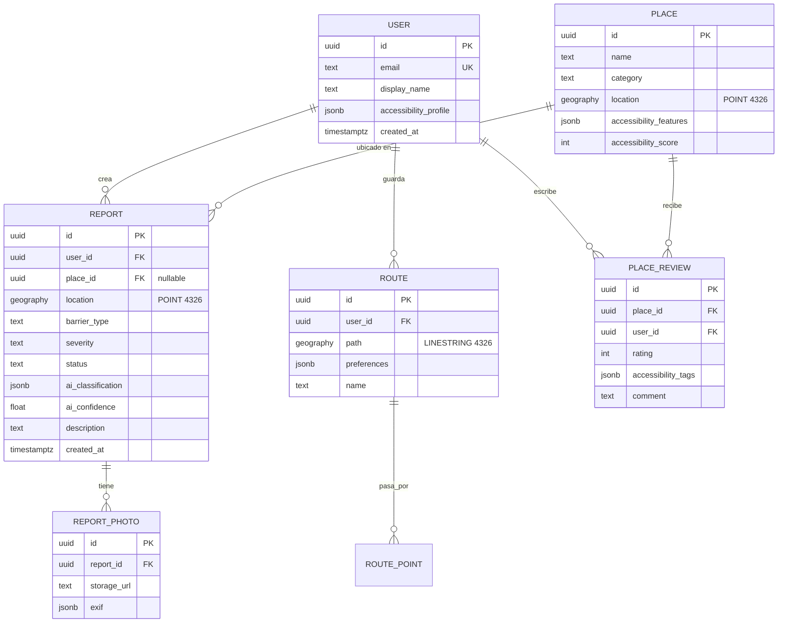

# Modelo de datos — Rutas Libres

> Decisión más cara de cambiar después. Definir ahora con cuidado.

## Stack

- **PostgreSQL 16** + extensión **PostGIS 3.x**
- Migraciones vía **Alembic**
- Tipos geoespaciales: `GEOGRAPHY(POINT, 4326)` para lugares, `GEOGRAPHY(LINESTRING, 4326)` para rutas

## Entidades principales



## Tablas en detalle

### `user`
Perfil mínimo. `accessibility_profile` guarda preferencias del usuario (silla de ruedas, baja visión, etc.) para personalizar rutas y alertas.

| columna | tipo | notas |
|---|---|---|
| id | uuid | PK, `gen_random_uuid()` |
| email | text | unique, indexado |
| display_name | text | opcional, público |
| accessibility_profile | jsonb | `{mobility: "wheelchair", vision: "low", ...}` |
| created_at | timestamptz | default `now()` |

### `place`
Lugar físico (comercio, estación, plaza). Puede venir de Google Places o ser creado por reportes agrupados.

| columna | tipo | notas |
|---|---|---|
| id | uuid | PK |
| name | text | |
| category | text | `restaurant`, `transit`, `public_space`, ... |
| location | geography(POINT, 4326) | **GIST index** |
| accessibility_features | jsonb | `{ramp: true, elevator: false, braille: true, ...}` |
| accessibility_score | int | 0-100, recalculado vía trigger |
| google_place_id | text | nullable, para sync |

### `report`
Núcleo del sistema. Un reporte de barrera o mejora puntual.

| columna | tipo | notas |
|---|---|---|
| id | uuid | PK |
| user_id | uuid | FK → user |
| place_id | uuid | FK → place, nullable (puede ser en vía pública) |
| location | geography(POINT, 4326) | **GIST index** |
| barrier_type | text | `stairs`, `broken_ramp`, `obstacle`, `no_signage`, ... |
| severity | text | `low`, `medium`, `high`, `blocking` |
| status | text | `pending`, `queued`, `approved`, `review`, `rejected` |
| ai_classification | jsonb | output crudo del modelo |
| ai_confidence | float | 0.0-1.0 |
| description | text | input del usuario |
| created_at | timestamptz | |
| expires_at | timestamptz | nullable, para barreras temporales (obra) |

**Índices clave:**
- `CREATE INDEX idx_report_location ON report USING GIST(location);`
- `CREATE INDEX idx_report_status_created ON report(status, created_at DESC);`
- `CREATE INDEX idx_report_place ON report(place_id) WHERE place_id IS NOT NULL;`

### `report_photo`
Fotos asociadas a un reporte. Separada para permitir 1..N fotos y facilitar purga.

### `route`
Ruta guardada por un usuario. `path` es un `LINESTRING` con los segmentos que el usuario transita habitualmente.

**Uso crítico**: cuando entra un nuevo reporte, se ejecuta
```sql
SELECT user_id FROM route
WHERE ST_DWithin(path, :report_location, 50);  -- 50m de buffer
```
para notificar solo a los afectados.

### `place_review`
Reseñas cualitativas. `accessibility_tags` permite búsqueda facetada (`{ramp: "good", bathroom: "accessible"}`).

## Consultas geoespaciales típicas

```sql
-- Reportes activos en un radio de 500m
SELECT * FROM report
WHERE status = 'approved'
  AND ST_DWithin(location, ST_MakePoint(:lng, :lat)::geography, 500)
  AND (expires_at IS NULL OR expires_at > now());

-- Heatmap: clusters de reportes por zona (grid de ~100m)
SELECT
  ST_SnapToGrid(location::geometry, 0.001) AS cell,
  COUNT(*) AS n
FROM report
WHERE status = 'approved'
GROUP BY cell;

-- Lugares accesibles cercanos ordenados por score
SELECT id, name, accessibility_score,
       ST_Distance(location, :user_loc) AS meters
FROM place
WHERE ST_DWithin(location, :user_loc, 1000)
  AND accessibility_score >= 70
ORDER BY meters ASC;
```

## Decisiones pendientes

- [ ] ¿Versionado de reportes? Si un lugar arregla la rampa, ¿editamos el reporte o creamos uno nuevo de tipo "mejora"?
- [ ] ¿Soft delete vs hard delete en `report`? Probablemente soft, por auditoría.
- [ ] ¿Particionado por fecha en `report` desde el día uno, o esperar a volumen?
